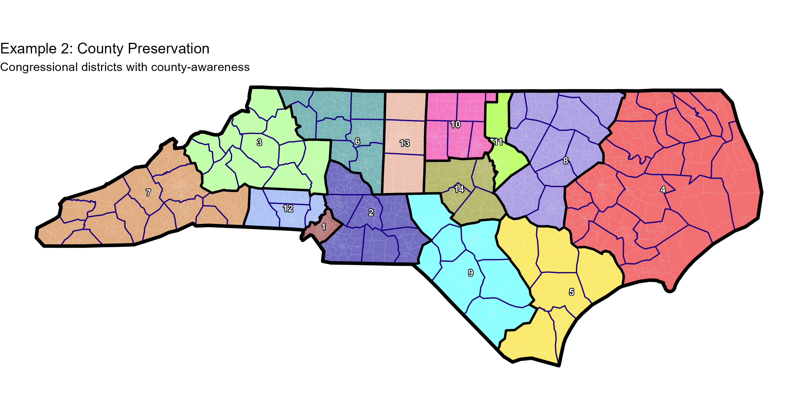

<p align="center">
  
</p>

<p align="center">
  <em>Redistricting for R</em>
</p>

---

## What is Mosaic?

Mosaic is an R-based redistricting toolkit that uses recombination (ReCom) to randomly generate many series of potential district maps. When paired with simulated annealing, Mosaic can optimize the map to meet users' specifications (like compactness, partisan fairness, and protecting communities of interest). 

In addition to basic VTD assignment files, Mosaic also includes the functionality to generate its own plots and gifs using recombination results.

Mosaic is a project of Matt Mohn [(@mattmxhn)](https://x.com/mattmxhn) but the recombination algorithm at the heart of Mosaic is derived from the one that was developed and refined by the MGGG Redistricting Lab.

---

## Quick Start

```r
# Load Mosaic
source("mosaic.R")
load_mosaic()

# Run a simple 14-district redistricting
results <- run_chain(
  shapefile_path = "shapefiles/North_Carolina_Simplified.shp",
  num_districts = 14,
  seed = 123456
)

# Visualize the result
mosaic_plot(
  shapefile_path = "shapefiles/North_Carolina_Simplified.shp",
  type = "simple",
  border_outline = TRUE,
  district_outline = TRUE
)
```

---

## Documentation

### Getting Started
- **[Installation Guide](docs/INSTALL.md)** - System requirements, dependencies, and setup instructions
- **[License](docs/LICENSE.md)** - MIT License

### Tutorials and Reference
- **[Mosaic in Action: North Carolina Examples](docs/tutorials/nc-examples.md)** - Seven comprehensive examples demonstrating Mosaic's capabilities
- **[Plot Guide](docs/tutorials/plotting_guide.md)**  - Guide and reference for `mosaic_plot()`, `mosaic_partisan_plot()`
- **[GIF Guide](docs/tutorials/gif-examples.md)** - Guide and reference for `mosaic_gif()`
- **[Scoring & Optimization](docs/scoring.md)**  - Explanation of `run_chain()` parameters, scoring metrics, and optimization strategies
- **[How Mosaic Works](docs/tutorials/infoguide.md)** - Understanding the ReCom algorithm, spanning trees, and simulated annealing
- **[Adding Your Own Shapefiles](docs/shapefiles.md)** - How to prepare shapefiles for Mosaic, including DRA import guide

#### Planned Future Options
- **[Future Extensions](docs/tutorials/extensions.md)** - Plans I'm working on, flaws I am aware of.
---

## Example Outputs

### Static Maps


### Partisan Analysis


### Animated Evolution


---

## Requirements

- **R** (≥ 4.0)
- **R Packages**: `sf`, `tidyverse`, `igraph`, `readr`, `ggplot2`, `dplyr`, `shadowtext`, `scales`, `magick`
- **System**: GDAL, GEOS, PROJ libraries (for spatial operations)

See [Installation Guide](docs/INSTALL.md) for detailed setup instructions.
