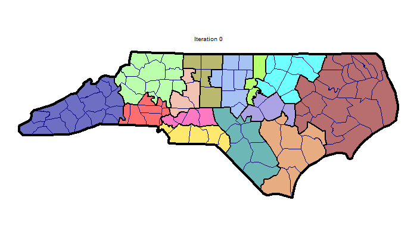

# Creating Animated GIFs with Mosaic


Mosaic can create animated GIFs showing how districts evolve during the optimization process. 
These are not only fun to look at  - it can help you better visualize algorithm behavior, and understand how different parameters affect redistricting outcomes.

## Table of Contents

1. [The Basics](#the-basics)
2. [The Somewhat Less Basics](#the-somewhat-less-basics)
2. [Other Notes](#other-notes)
2. [Example 1: Simple Compactness](#example-1-simple-compactness)
3. [Example 2: Partisan Fairness](#example-2-partisan-fairness)


---

## The Basics

Creating a GIF requires two steps:

1. **Run the chain** with `run_chain()` with `snapshot_assignments == TRUE` (default).
2. **Generate the GIF** using `mosaic_gif()` to animate those snapshots.

---

## The Somewhat Less Basics

The `mosaic_gif()` function offers extensive control over your animations. Here's every parameter explained:

### Required Parameters

**`shapefile_path`**  
Path to your shapefile. This works perfectly with the shapefile you used in `run_chain()` - but you don't __have__ to use it. 

For example, you can use a highly-detailed shapefile for `run_chain()` but then decide to use a low-resolution or generalized shapefile for `mosaic_gif()`. As long as the precinct ID attributes in the shapefile (e.g. GEOID20) match, this substitution can help you save rendering time.

```r
shapefile_path = "shapefiles/North_Carolina_Simplified.shp"
```

---

### Input Data

**`assignments_csv`** *(default: NULL)*  
Path to the snapshot assignments CSV. If `NULL`, uses the most recent file in `output/`.

```r
assignments_csv = "output/snapshot_assignments_12202025_1234.csv"
```

**`metrics_csv`** *(default: NULL)*  
Path to metrics CSV (required for **partisan** coloring, just as with `mosaic_plot()`). If `NULL`, uses the most recent file.

```r
metrics_csv = "output/metrics_12202025_1234.csv"
```

**`output_dir`** *(default: NULL)*  
Directory containing your output files. If `NULL`, uses `mosaic_path("output")`.

---

### Output Settings

**`output_path`** *(default: NULL)*  
Where to save your GIF. If `NULL`, saves to `gifs/` with timestamp.

```r
output_path = "my_animations/nc_evolution.gif"
```

**`width`** *(default: 500)*  
GIF width in pixels. Larger = better quality but bigger file size.

```r
width = 800  # High quality for presentations
```

**`height`** *(default: 500)*  
GIF height in pixels.

```r
height = 800
```

**`fps`** *(default: 10)*  
Frames per second. Higher = faster animation.

```r
fps = 15  # Faster playback
fps = 5   # Slower, more contemplative
```

By default, `mosaic_gif()` will hold the first and last frames (representing the start and end of the annealing) for 2 seconds each. The `fps` speed only applies to intervening frames.


---

### Visualization Type

**`type`** *(default: "simple")*  
Coloring scheme for districts.

- `"simple"`: Each district gets a distinct color. 
- `"partisan"`: Districts colored by Democratic vote share (requires partisan data to be have compiled in a metrics file).

If a Mosaic run was done that did *not* include partisan data, it is impossible for Mosaic to create plots **or** gifs that use political / party information. At least one political metric weight, like `weight_mean_median` must be set, if even to 0, for Mosaic to track electoral results.

Note, the final frame of a `"simple"` gif may not exactly match, color-to-color, a `"simple"` plot from `mosaic_plot()`. This is because on a frame-by-frame basis, `mosaic_gif()` recalculates district-to-color assignments to minimize the shuffling that happens across the map in a recombination system.


```r
type = "simple"     # Basic coloring
type = "partisan"   # Show partisan lean
```

---

### Visual Elements

**`border_outline`** *(default: FALSE)*  
Draw thick black line around entire state.

```r
border_outline = TRUE   # Emphasize state boundary
border_outline = FALSE  # Cleaner look
```

**`district_outline`** *(default: FALSE)*  
Draw black lines between districts.

```r
district_outline = TRUE   # Clear district boundaries
district_outline = FALSE  # Seamless appearance
```

**`county_outline`** *(default: FALSE)*  
Draw navy lines along county boundaries.

```r
county_outline = TRUE   # Show county structure
county_outline = FALSE  # Simpler map
```

**`precinct_outline`** *(default: FALSE)*  
Draw faint white lines between precincts.

```r
precinct_outline = TRUE   # Show fine detail (can be extremely cluttered for a gif)
precinct_outline = FALSE  # Cleaner appearance
```

---

### Advanced Features

**`bunking_lists`** *(default: NULL)*  
Show bunking markers as diamonds on the map.

```r
bunking_lists = create_bunking_lists(
  anti_bunking = list(incumbent_list)
)
```

Yellow diamonds = anti-bunking (keep apart)  
Blue diamonds = pro-bunking (keep together)

---

## Other Notes

### Choosing Snapshot Intervals

The `snapshot_interval` parameter in `run_chain()` controls how smooth your animation is.

- **`snapshot_interval = 10`**: Very smooth, large file size, slower to generate
- **`snapshot_interval = 50`**: Good balance (Default)
- **`snapshot_interval = 100`**: Choppy but fast, small file

For a 2000-step run:

- Interval 50 = 41 frames (~4 seconds at 10 fps)
- Interval 100 = 21 frames (~2 seconds at 10 fps)

By default, `mosaic_gif()` will hold the first and last frames (representing the start and end of the annealing) for 2 seconds each. The `fps` speed only applies to intervening frames.

### File Sizes

GIFs can get large. A larger GIF also takes longer to render. To keep them manageable:

- **Limit dimensions**: 600x600 is usually plenty. You can increase visual acuity at small dimensions by leaving `OUTLINE == FALSE` wherever possible.
- **Skip precinct outlines**: Because of the detail, these really increase file size.
- **Choose intervals wisely**: Every 50 iterations is usually sufficient

---

## Troubleshooting


**"No snapshot assignments found"**  
Make sure you ran `run_chain()` with `snapshot_assignments = TRUE`.

**GIF generation is slow**  
Large shapefiles with many precincts take time. Expect 1-3 minutes for typical state-level maps.

**GIF file is huge**  
Reduce `width`/`height`, increase `snapshot_interval`, or turn off `precinct_outline`.

**Colors look wrong in partisan mode**  
Ensure your shapefile has `DEM` and `REP` columns, and that you ran with partisan metrics enabled. This can lead the gif to revert to simple mode.

**"No partisan data found in metrics file" / GIF reverts to simple mode**  
This happens when you use `type = "partisan"` but didn't run the chain with any partisan objectives. The partisan coloring requires `dem_share_d*` columns in the metrics file, which are only created when you use partisan weights.

**Solution**: Re-run your chain with at least one partisan parameter:
```r
run_chain(
  ...,
  target_mean_median = 0,      # Add this
  snapshot_assignments = TRUE
)
```

Even if you're just aiming for compactness, adding `target_mean_median = 0` with a small weight will enable partisan tracking without significantly affecting the optimization.

**"cannot open file" / "No such file or directory"**  
The output directory doesn't exist. Either:
- Let Mosaic auto-create it by using `output_path = NULL` (saves to `gifs/` folder)
- Manually create the directory: `dir.create("path/to/folder", recursive = TRUE)`
- Use a simpler path: `output_path = "my_animation.gif"` (saves to current directory)


---

## Running These Examples

All code from this tutorial is available in [`examples/gif-examples.R`](../../examples/gif-examples.R). To run:

```r
source("mosaic.R")
load_mosaic()
source("examples/gif-examples.R")
```

To regenerate the tutorial GIFs:

```r
source("generate_gif_examples.R")
```

*Note: Generating GIFs takes 5-10 minutes depending on your system.*

---

## Example 1: Simple Compactness

This example shows the algorithm minimizing cut edges while respecting county boundaries. We'll create 14 congressional districts over 2000 iterations, applying a county bias to encourage splits along county lines.

### Code

```r
source("mosaic.R")
load_mosaic()

SHAPEFILE <- "shapefiles/North_Carolina_Simplified.shp"

# Run the chain
results <- run_chain(
  shapefile_path = SHAPEFILE,
  num_districts = 14,
  num_steps = 2000,
  seed = 123456,
  county_bias = 10,
  weight_county_splits = 10,
  snapshot_assignments = TRUE,
  snapshot_interval = 50,
  verbose_console = FALSE
)

# Create the GIF
mosaic_gif(
  shapefile_path = SHAPEFILE,
  type = "simple",
  output_path = "example1_simple.gif",
  fps = 10,
  border_outline = TRUE,
  district_outline = TRUE,
  county_outline = TRUE,
  precinct_outline = FALSE,
  width = 700,
  height = 400
)
```

### Result



*Watch as districts become more compact and respect county boundaries over 2000 iterations.*

The algorithm found 548 cut edges by iteration 2000 and maintained compact districts while splitting only ~3 counties.

---

## Example 2: Partisan Fairness

This example optimizes for partisan fairness by targeting a mean-median difference of zero while still maintaining geographic compactness. The partisan coloring shows how district political compositions shift as the algorithm balances competing objectives.

### Code

```r
# Run the chain
results <- run_chain(
  shapefile_path = SHAPEFILE,
  num_districts = 14,
  num_steps = 2000,
  seed = 654321,
  county_bias = 5,
  weight_county_splits = 5,
  target_mean_median = 0,
  weight_mean_median = 100,
  snapshot_assignments = TRUE,
  snapshot_interval = 50,
  verbose_console = FALSE
)

# Create the GIF with partisan coloring
mosaic_gif(
  shapefile_path = SHAPEFILE,
  type = "partisan",
  output_path = "example2_partisan.gif",
  fps = 10,
  border_outline = TRUE,
  district_outline = TRUE,
  county_outline = TRUE,
  precinct_outline = FALSE,
  width = 700,
  height = 400
)
```

### Result

Over the course of 2000 runs, the program decreased total cuts from 815 to 489, total county splits from 30.91 to 8.48, all while keeping `MM_DIFF` (a measure of partisan skew) to R+1.9%, which is within a healthy range.


