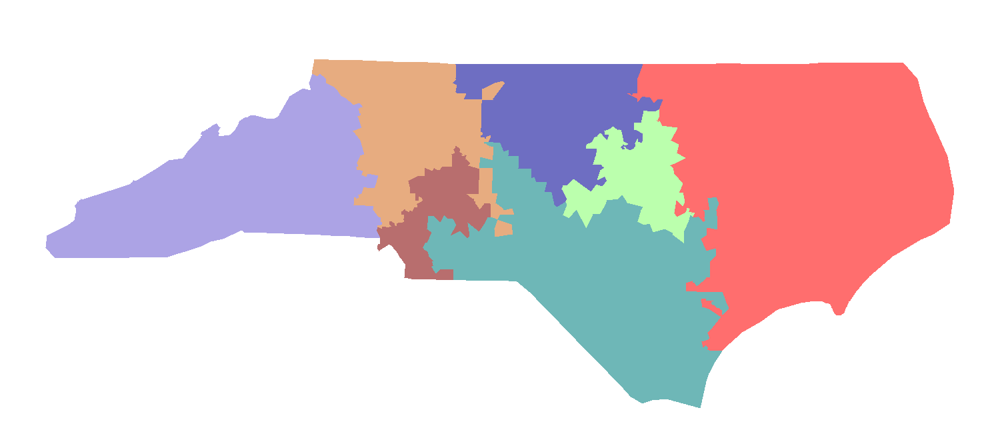
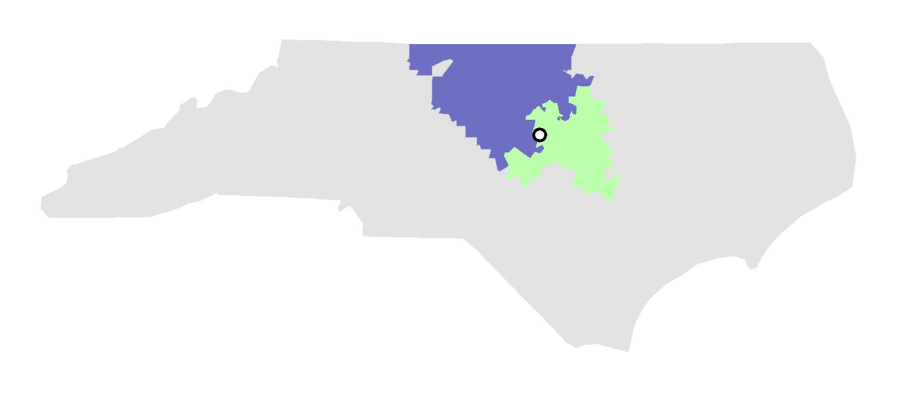
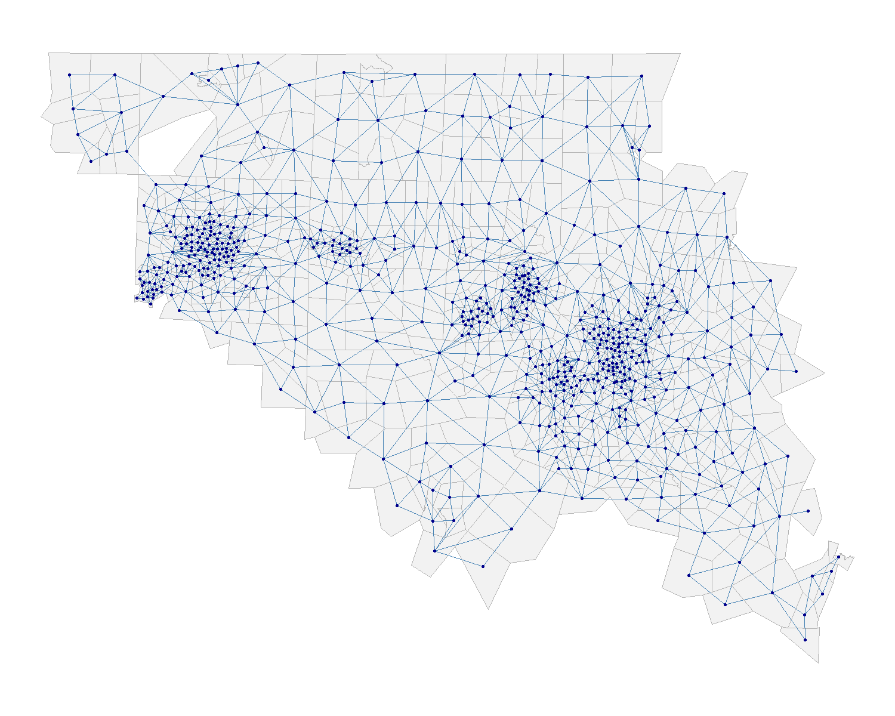
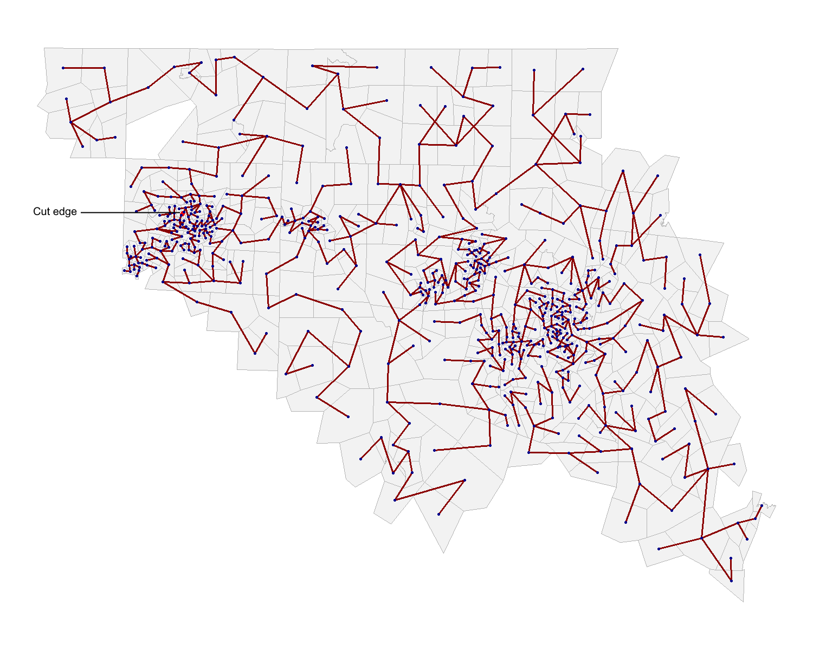
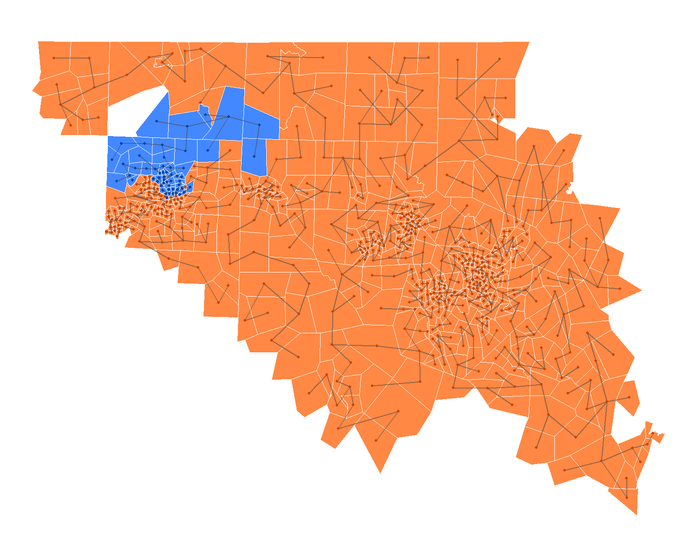
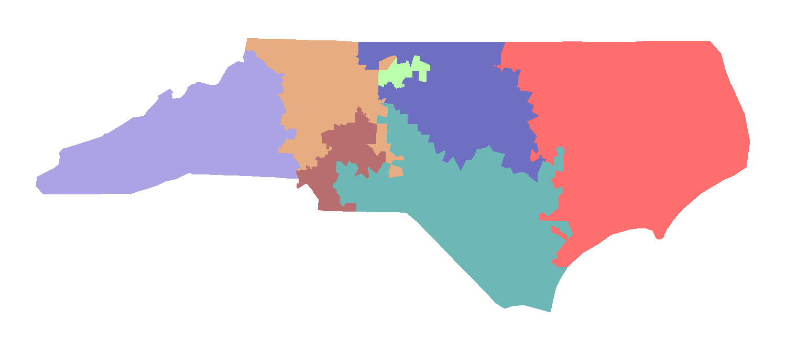

# How Mosaic Works

This guide explains the algorithms that power Mosaic: **ReCom** (Recombination) for generating new district maps, and **Simulated Annealing** for optimization.

## Table of Contents

1. [ReCom: The Recombination Algorithm](#recom-the-recombination-algorithm)
2. [Simulated Annealing](#simulated-annealing)
3. [Graph Caching](#graph-caching)
4. [Performance Considerations](#performance-considerations)

---

## ReCom: The Recombination Algorithm

ReCom is the core algorithm that generates new district maps. It works by repeatedly *recombining* pairs of adjacent districts to create new configurations while maintaining contiguity and population balance.

ReCom was developed by MGGG (DeFord et al., "Recombination: A family of Markov chains for redistricting" (2021)) but this implementation is not exactly the same as what you see in GerryChain.


Let's walk through one ReCom step using North Carolina divided into 7 districts.

---

### Step 1: Starting Map

We begin with an existing valid map - 7 districts, each contiguous and population-balanced. A little atrocious to the eyes, but that's no crime.



Each district is a different color. The boundaries between districts represent **cut edges** - connections between precincts in different districts.

---

### Step 2: Sample a Cut Edge

The algorithm randomly selects one cut edge - a boundary between two adjacent districts. It turns out to be a boundary southwest of Raleigh in between the blue and light-green districts.



The two selected districts are shown in their original colors, with the rest of the map grayed out. The white dot (with black outline) marks the specific edge that was sampled. These two districts will be recombined.

---

### Step 3: Merge the Two Districts

We merge the two districts into a single region containing all their precincts.


The merged region is shown in dark gray. The other 5 districts remain unchanged (shown faded). Our task: re-divide this merged region into two new districts.

---

### Step 4: Convert to Graph

We represent the merged region as a graph where:
- Each **node** = one precinct
- Each **edge** = two precincts that share a boundary



This graph has the same connectivity as the physical geography. If two precincts touch in real life, they're connected in the graph.

---

### Step 5: Generate Spanning Tree

We create a **minimum spanning tree (MST)** of this graph - a tree that connects all precincts using a subset of edges.


The spanning tree (shown in bold) touches every precinct exactly once. It's generated randomly, so different trees lead to different partitions.

**Note on county_bias:** When `county_bias > 1`, edges that cross county boundaries get higher weights, making them *less likely* to be included in the spanning tree. This encourages the tree to follow county boundaries, which later produces maps that split fewer counties.

---

### Step 6: Cut the Spanning Tree

We randomly select a point on the spanning tree to cut. 



The dashed red edge marks where we cut the tree. You may have to squint closely- it's in Greensboro. This splits the tree into two **subtrees**. Because we used a minimum spanning tree (MST) to cut, it's guaranteed that each subtree will be contiguous - we don't even have to check.

---

### Step 7: Color the Subtrees

Each subtree becomes a new district. We color the precincts according to which subtree they belong to.



- **Blue** = First new district
- **Orange** = Second new district

Before we proceed any further, we have to take a second and confirm that **both** of these new potential districts fulfill population tolerance requirements that we set in `pdev_tolerance`. It's likely that our example here would fail, since the orange district includes Durham, Chapel Hill, Raleigh, and High Point while the blue district only got the north half of Greensboro.

If the map fails at this stage, we don't revert any farther than Step 6 - we pick a different edge to cut until we succeed.


---

### Step 8: Return to Full Map

We place the two new districts back into the full 7-district map.



The two original districts have been recombined into two new districts with different boundaries. The other 5 districts remain unchanged, so we don't need to recalculate _their_ cut-edges or statistics, which saves time.

This completes one ReCom step. Mosaic repeats this process thousands of times, each time:

1. Selecting a random cut edge
2. Merging the two adjacent districts into a new MST
3. Recombining them into a new configuration by cutting the MST
4. Repeat step 3 until proposed cut fits `pdev_tolerance` requirements
5. Scoring the result


---

## Simulated Annealing

ReCom generates *new* maps, but how do we find *better* maps? That's where simulated annealing comes in.

### The Challenge: Local Minima

Imagine you're trying to minimize cut edges. If we only accept changes that reduce the score, we might get stuck:

```
Current map: 650 cut edges
Try new map: 660 cut edges → Reject (worse)
Try new map: 655 cut edges → Reject (worse)
Try new map: 670 cut edges → Reject (worse)
...stuck at 650 forever
```

But what if accepting one of those "worse" moves temporarily would let us find a much better solution?

```
Current map: 650 cut edges
Accept worse: 660 cut edges → Accept anyway!
Continue from 660...
Eventually reach: 520 cut edges ← Much better!
```

That's the idea behind simulated annealing.

---

### How Simulated Annealing Works

The algorithm has a "temperature" that controls how willing it is to accept worse moves:

**High temperature (early):**

- Accept many moves that worsen the score
- Explore widely, escape local minima
- Example: Accept a move from 650 → 660 with 70% probability

**Medium temperature (middle):**

- Still accept some worse moves, but more selective
- Balance exploration and optimization
- Example: Accept a move from 650 → 660 with 30% probability

**Low temperature (late):**

- Rarely accept worse moves
- Focus on fine-tuning
- Example: Accept a move from 650 → 660 with 5% probability

The temperature gradually **cools** over time (hence "annealing"), transitioning from exploration to optimization.

---

### Acceptance Rule

For each proposed map, we decide whether to accept it. If the new score is better, we always accept. If it's worse, we accept with some probability that depends on the temperature.

**Key insight:** Higher temperature → higher probability of accepting worse moves.

Example with temperature = 50:

- Small increase (delta = 10): probability = exp(-10/50) = 82% → likely accept
- Large increase (delta = 100): probability = exp(-100/50) = 14% → unlikely accept

Example with temperature = 5:

- Small increase (delta = 10): probability = exp(-10/5) = 14% → unlikely accept
- Large increase (delta = 100): probability = exp(-100/5) = 0.0003% → essentially never

---

### Cooling Schedule

Mosaic uses **guided cooling** by default. You specify when to reach a low temperature (e.g., 90% through the run) and what that target temperature should be (e.g., 1). Mosaic calculates the cooling rate automatically.

For a 3000-step run:

- Start: Temperature = 600 (proportional to initial score)
- Step 2700 (90%): Temperature = 1
- End: Temperature ≈ 0.36


