# North Carolina Tutorials

A longer introduction to Mosaic's capabilities - using North Carolina precinct data.

## Table of Contents

1. [Setup](#setup)
2. [Example 1: Simple Redistricting](#example-1-simple-redistricting)
3. [Example 2: Preserving Counties](#example-2-preserving-counties)
4. [Example 3: Republican Gerrymander](#example-3-republican-gerrymander)
5. [Example 4: Democratic Gerrymander](#example-4-democratic-gerrymander)
6. [Example 5: Fair State Senate Map](#example-5-fair-state-senate-map)
7. [Example 6: Dealing with Incumbents](#example-6-dealing-with-incumbents)
8. [Example 7: Communities of Interest](#example-7-communities-of-interest)

---

## Setup

All examples use the included `North_Carolina_Simplified.shp` shapefile. This is a generalized (simplified) shapefile of North Carolina's VTD election precincts, with the following attribute columns as well as geographic details. The election data is taken from the 2024 presidential election. Generalizing the shapefile lets us operate slightly faster, especially when visualizing maps, but has no effect on the contiguity between different precincts.

- **GEOID20** `<chr>` - VTD identifier string unique to each precinct
- **CTY** `<chr>` - County ID string identifying the precinct's county
- **POP** `<dbl>` - Resident count in the precinct
- **DEM** `<dbl>` - Democratic votes in the precinct (2024 presidential)
- **REP** `<dbl>` - Republican votes in the precinct (2024 presidential)

To run these examples yourself, first:

```r
source("mosaic.R")
load_mosaic()

SHAPEFILE <- "shapefiles/North_Carolina_Simplified.shp"
```

---

## Example 1: Simple Redistricting

Let's set up and run the chain.

By default, Mosaic will run for 1000 iterations with a `pdev_tolerance` (acceptable population deviation) of ±5%, and applies a cut edge weight of 1 (`weight_cut_edges = 1`). It will produce 5 districts by default, but we want North Carolina to have the 14 congressional districts it has in real life, so we set `num_districts` to 14 here.

### Code

```r
results <- run_chain(
  shapefile_path = SHAPEFILE,
  num_districts = 14,
  seed = 123456
)
```

### Results

_Note - these tables are copied from what is printed to console for your visiblity._

| Iter | Score | Cuts |
| --- | --- | --- |
| 0 | 838 | 838 |
| 250 | 770 | 770 |
| 500 | 631 | 631 |
| 750 | 578 | 578 |
| 1000 | 540 | 540 |

The results of the annealing are encouraging: the program initialized with 838 cuts (which isn't bad itself) and then fell to 540 over the course of the run.

The score perfectly matches the number of cuts because that's the only weight that we used.

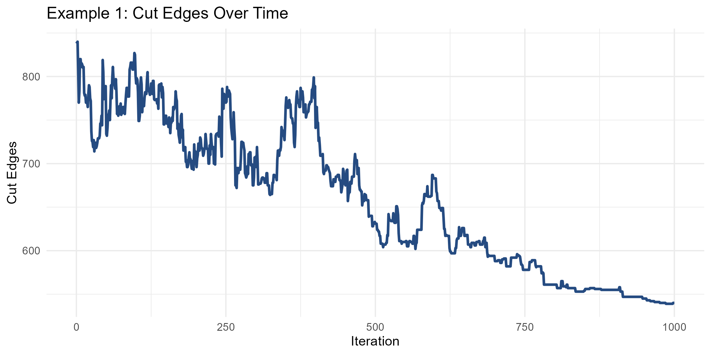

### Visualizing the Map

*Knowing* the results is only a part of the fun. Let's see what the map actually looks like.

Mosaic includes the `mosaic_plot` function, which can create nice-looking maps on the fly. By default, `mosaic_plot` will call from the most recently saved final assignments file.

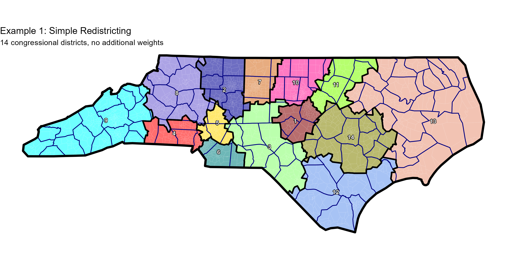

### Analysis

It looks great! All of the districts are fairly compact and there aren't many weird shapes. One issue jumps out though—we're splitting counties all over the place (look at Charlotte or Raleigh!). That makes sense; we didn't tell Mosaic to try in the first place. For that, let's move to Example 2.

---

## Example 2: Preserving Counties

To better preserve counties, we take the same `run_chain()` call from earlier but make two critical changes.

First, we apply `county_bias`. The recombination algorithm generates a random spanning tree to determine where to cut. By setting `county_bias` to 10, we multiply the weight of cross-county edges by 10, making them more expensive for the minimum spanning tree algorithm. This makes the algorithm prefer edges *within* counties, causing cuts to naturally fall *between* counties rather than splitting them.

Second, although `county_bias` will naturally lead to maps with fewer county splits, we also want the algorithm to try and value low-splitting as a general practice. We set `weight_county_splits` to 15. There are no units involved, but by default this means that 1 county split will be worth as much as 15 additional cut edges in annealing.

### Code

```r
results <- run_chain(
  shapefile_path = SHAPEFILE,
  num_districts = 14,
  seed = 12345,
  county_bias = 10,
  weight_county_splits = 15
)
```

### Results

| Iter | Score | Cuts | County Splits |
| --- | --- | --- | --- |
| 0 | 954.9 | 725 | 15.32 |
| 250 | 859.4 | 625 | 15.62 |
| 500 | 797.1 | 614 | 12.21 |
| 750 | 603.8 | 495 | 7.25 |
| 1000 | 511 | 475 | 2.4 |

The initial score (954) reflects the number of cut edges (725) plus 15 times the number of county splits (15.3). After 1000 iterations, the score has fallen to 511, with 475 cut edges and just 2.40 county splits.

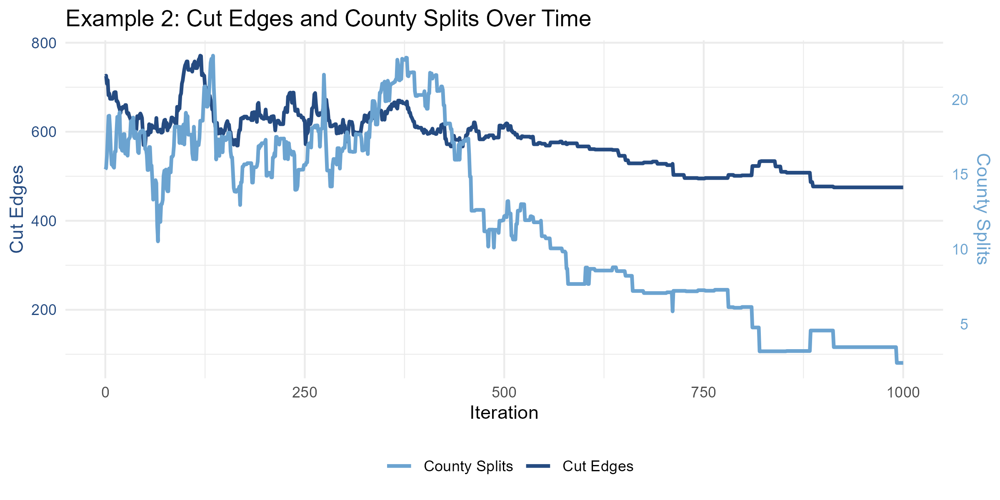

For due diligence's sake, let's plot the map just to be sure.

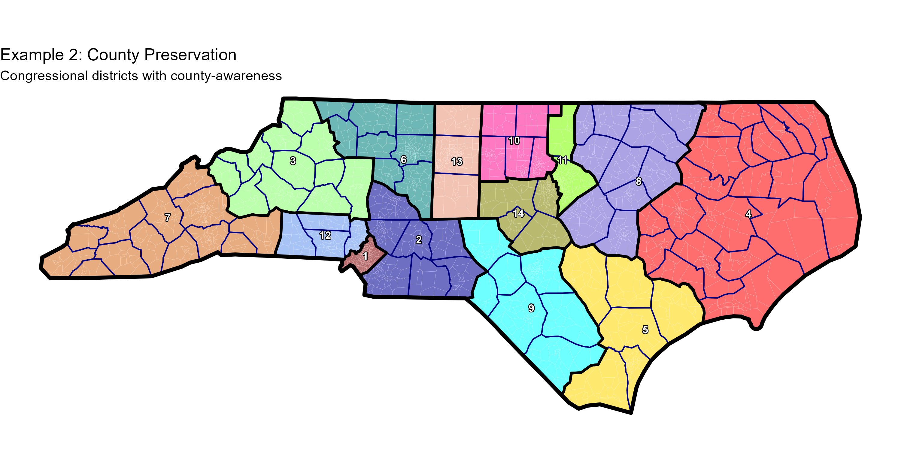

### Analysis

Looks good!

There are different ways of measuring county splits. Four counties are split here (Granville, Mecklenburg, Wake, and Wilkes) but because Meck and Wake are larger than a district each, we subtract them from the total, taking us down to 2.

The remaining 0.4 comes from a measure of fragmentation—this penalizes splits that are especially egregious.

Now that we know how to draw geographically nice-looking maps, Example 3 will explore using partisan data.

---

## Example 3: Republican Gerrymander

For Example 3, let's attempt to draw a Republican gerrymander—which, not coincidentally, is what the North Carolina General Assembly has been doing for the past two decades anyway. Learn from the best, right?

### Strategy

Let's use the following settings:

- **Decrease `county_bias` to 2.** First off, we care less about county splits this time around. Second, when we're looking to pull off partisan objectives, we don't want to constrain the set of possible combinations available to us.
- **Decrease `weight_county_splits` to 5**—again, nice to have, but not something mission-critical.
- **Increase `num_steps` to 3000** up from the default 1000, to give us more room to maneuver.
- **Set `target_efficiency_gap` to 0.5**, meaning we aim for Republican votes to be 50% more efficient than Democratic ones. We weight this at 100 using `weight_efficiency_gap`.
- **Set `target_mean_median` to 0.15**, meaning we want the median district in North Carolina to be 15% more Republican by share of the vote than the state as a whole. If the state votes for a Democrat, we still want a majority to be won by Republicans. We weight this at 50 using `weight_mean_median`.
- **Finally, set `target_dem_seats` to 2.** This is pretty self-explanatory! We could aim for 0, but that would be very difficult and we don't want the score to be too meaningless. We weight this even further, to 250, using `weight_dem_seats`.

### Code

```r
results <- run_chain(
  shapefile_path = SHAPEFILE,
  num_districts = 14,
  seed = 123456,
  county_bias = 2,
  weight_county_splits = 5,
  target_efficiency_gap = 0.5,
  weight_efficiency_gap = 100,
  target_mean_median = 0.15,
  weight_mean_median = 50,
  num_steps = 3000,
  target_dem_seats = 2,
  weight_dem_seats = 250
)
```

### Results

| Iter | Score | Exp Dem Seats | MM | Eff. Gap | County Splits | Cuts |
| --- | --- | --- | --- | --- | --- | --- |
| 0 | 4894.7 | **5.1** | +2.7% | +13.1% | 59.67 | 786 |
| 250 | 4474 | **4.9** | +1.8% | +14.3% | 53.38 | 725 |
| 500 | 3797.4 | **4.5** | +2.1% | +16.9% | 61.73 | 766 |
| 750 | 2940.5 | **4.1** | +5.4% | +21.0% | 54.36 | 701 |
| 1000 | 2713.3 | **3.9** | +3.1% | +22.0% | 47.47 | 737 |
| 1250 | 2796.9 | **4.0** | +3.7% | +22.9% | 53.22 | 768 |
| 1500 | 2410.7 | **3.8** | +3.8% | +24.1% | 46.13 | 675 |
| 1750 | 2302.5 | **3.6** | +4.1% | +24.3% | 44.91 | 697 |
| 2000 | 2168.3 | **3.5** | +4.4% | +24.5% | 42.56 | 655 |
| 2250 | 2109.5 | **3.5** | +4.7% | +25.0% | 42.48 | 653 |
| 2500 | 2062 | **3.5** | +4.7% | +24.7% | 34.61 | 623 |
| 2750 | 2043.7 | **3.5** | +5.0% | +24.8% | 33.58 | 625 |
| 3000 | 2044.6 | **3.5** | +5.0% | +24.8% | 33.23 | 631 |

The results are encouraging. `MM DIFF` is R+5.0 (not R+15, our target, but pretty good for 3000 runs), and `EG ADJ` (efficiency gap adjusted over a few different swing scenarios) hit R+25.

The model expects Republicans to win 10.5 seats over the long-run average, with Democrats winning only 3.5—but the seat table makes it pretty clear that in most years this is an 11-3 map.

Once again, we graph using `mosaic_plot`—this time, however, we can set `type` to 'partisan' and look at the districts' final partisanship. This only works if we ran the annealing using partisan data; otherwise the annealing will not store this information.

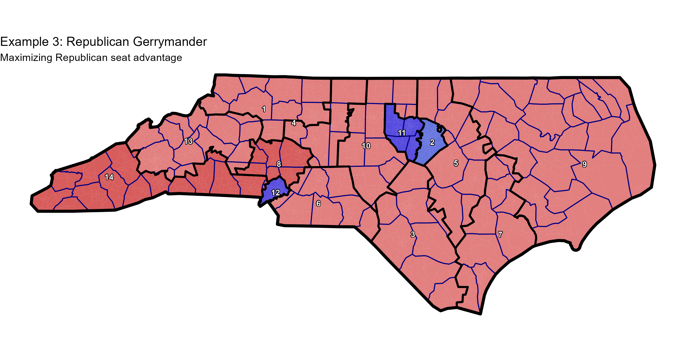

### Analysis

Anyone familiar with North Carolina gerrymandering history will immediately recognize this kind of map.

- **The Triad is cracked.** Greensboro and Winston-Salem are put into separate districts. District 1 (the Winston-to-TN district) looks like Virginia Foxx's NC-5 from 2001-2021. Greensboro itself is split perfectly in half.
- **Charlotte, Raleigh, Chapel Hill, and Durham are all packed into deep blue districts.**
- **The Black Belt is split.** Goldsboro, Kinston, and Rocky Mount all end up in three different districts.
- **Two claws form around the Triangle** (Districts 5 and 10) instead of a district forming along the VA border.
- **Fayetteville's district reaches south** (towards South Carolina). Any other direction would be more purple.
- **The purple-ish suburbs around Charlotte end up in three different districts.**

All of these choices (major and minor) contribute to this kind of partisan lean, but the algorithm figured out unknowingly what took Republican mapmakers a while to master.

Let's check out the partisan skew using `mosaic_partisan_plot`:

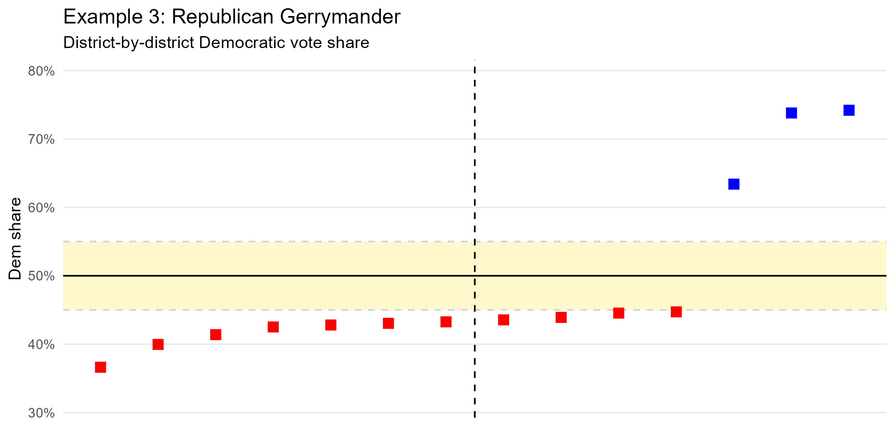

Gerrymandering in North Carolina is a bipartisan tradition, however, so for the reverse take, check out Example 4.

---

## Example 4: Democratic Gerrymander

For the Democratic attempt, we will basically reverse the settings from Example 3. The changes are:

- Set `target_efficiency_gap` to -0.3, meaning we aim for **Democratic** votes to be 30% more efficient than Republican ones.
- Set `target_mean_median` to -0.1, meaning we want the median district in North Carolina to be 10% **less** Republican by share of the vote than the state as a whole.
- Finally, set `target_dem_seats` to 11.

For concision, let's suppress the console output summaries with `verbose_console = FALSE`.

### Code

```r
results <- run_chain(
  shapefile_path = SHAPEFILE,
  num_districts = 14,
  seed = 123456,
  county_bias = 2,
  weight_county_splits = 5,
  target_efficiency_gap = -0.3,
  weight_efficiency_gap = 100,
  target_mean_median = -0.1,
  weight_mean_median = 50,
  num_steps = 3000,
  target_dem_seats = 11,
  weight_dem_seats = 250,
  verbose_console = FALSE
)
```

### Results

| Iter | Score | Exp Dem Seats | MM | Eff. Gap | County Splits | Cuts |
| --- | --- | --- | --- | --- | --- | --- |
| 0 | 11783.5 | **5.1** | +2.7% | +13.1% | 59.67 | 786 |
| 250 | 6867.3 | **6.5** | -0.6% | -0.6% | 52.03 | 747 |
| 500 | 7254.5 | **6.4** | +0.3% | +0.8% | 48.8 | 773 |
| 750 | 6088.9 | **6.9** | -1.1% | -3.6% | 58.53 | 784 |
| 1000 | 5000 | **7.3** | -3.8% | -6.5% | 53.93 | 699 |
| 1250 | 4692.2 | **7.4** | -4.0% | -8.2% | 55.91 | 766 |
| 1500 | 4482.6 | **7.6** | -4.9% | -8.0% | 58.57 | 732 |
| 1750 | 4026.1 | **7.8** | -6.4% | -9.7% | 53.21 | 794 |
| 2000 | 3725.6 | **7.9** | -7.3% | -10.4% | 43.49 | 718 |
| 2250 | 3610.5 | **7.9** | -8.1% | -10.9% | 42.26 | 696 |
| 2500 | 3540 | **8.0** | -8.1% | -10.8% | 35.19 | 672 |
| 2750 | 3498.6 | **8.0** | -8.0% | -10.9% | 33.99 | 651 |
| 3000 | 3454.8 | **8.0** | -8.4% | -10.7% | 33.59 | 641 |

The results look great, but in the opposite direction from earlier. `MM DIFF` is D+8.4, meaning the median district gave Kamala Harris 57.1% of the vote, while the average across the state was just 48.7%.

`EG ADJ` is D+10.7, and the model expects Democrats to win 8.0 seats and Republicans 6.0.

Again, we graph using `mosaic_plot`.

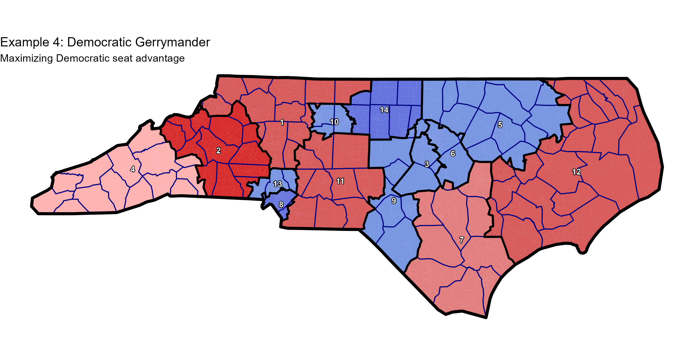

### Analysis

Here, many of the opposite decisions from the Republican map have been taken.

- **Charlotte is cracked in two—not packed.** The resulting districts (12 and 6) both vote solidly blue.
- **Similarly, the Triangle is cracked—not packed**—and its blue votes are distributed into 5 different districts.
- **The Piedmont Triad is mostly united in District 10** (with some of Greensboro's excess blue elsewhere). Fayetteville's district aims north to purple Raleigh suburbs, not east.

On the Tennessee border, Mosaic sees a chance at a competitive district, and while it can't draw a blue one, it follows the ghost of Heath Shuler to come up with one (District 4) that Trump only won by 7 points.

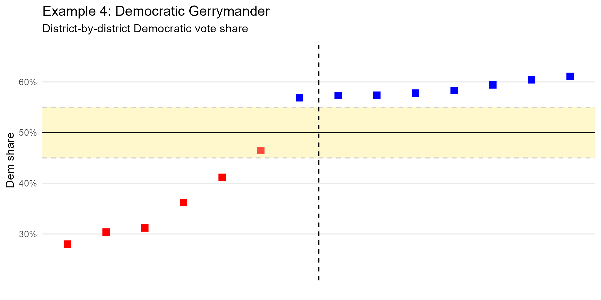

---

## Example 5: Fair State Senate Map

Let's deploy the partisan tools for a good cause—drawing a fair and competitive North Carolina State Senate map.

### Strategy

- **Switch `target_mean_median` to 0 and `target_efficiency_gap` to 0.** This is the same as favoring neither party.
- **Introduce `weight_competitiveness` to 5.** This metric tries to increase the share of districts that are competitive, where a 100% competitive district is defined as having a 50/50 chance of going to either party.
- **Bolster our county tools**, like `county_bias` and `weight_county_splits`—since we're after noble causes now.

### Code

```r
results <- run_chain(
  shapefile_path = SHAPEFILE,
  num_districts = 50,
  seed = 123456,
  county_bias = 5,
  weight_county_splits = 10,
  target_mean_median = 0,
  weight_mean_median = 150,
  target_efficiency_gap = 0,
  weight_efficiency_gap = 100,
  weight_competitiveness = 5,
  num_steps = 5000,
  verbose_console = FALSE
)
```

### Results

| Iter | Score | MM | Eff. Gap | Cuts | County Splits | Exp Competitive Seats |
| --- | --- | --- | --- | --- | --- | --- |
| 0 | 2599 | **+2.0%** | +1.7% | 1584 | 55 | 4.4 |
| 250 | 2476.4 | **+0.9%** | +1.7% | 1471 | 55.38 | 5.3 |
| 500 | 2671.5 | **+1.8%** | +0.7% | 1489 | 72.31 | 4.6 |
| 750 | 2473.9 | **-1.4%** | +1.3% | 1476 | 57.16 | 7.8 |
| 1000 | 2594.5 | **+1.6%** | +2.9% | 1468 | 67.44 | 6.0 |
| 1250 | 2535.2 | **-1.2%** | +1.3% | 1447 | 65.91 | 7.5 |
| 1500 | 2535.1 | **+1.2%** | +1.7% | 1468 | 61.87 | 5.7 |
| 1750 | 2530.1 | **+3.2%** | +4.3% | 1479 | 56.54 | 4.8 |
| 2000 | 2366.3 | **+2.1%** | +5.3% | 1416 | 47.49 | 5.9 |
| 2250 | 2337.9 | **+1.4%** | +3.3% | 1404 | 49.42 | 7.4 |
| 2500 | 2219.1 | **+1.3%** | +2.2% | 1363 | 41.72 | 6.8 |
| 2750 | 2221.5 | **+0.4%** | +2.0% | 1325 | 48.13 | 8.9 |
| 3000 | 2269 | **+0.8%** | +2.1% | 1365 | 46.96 | 7.1 |
| 3250 | 2153.4 | **+0.6%** | +2.5% | 1325 | 39.58 | 7.4 |
| 3500 | 2139.8 | **+1.1%** | +3.1% | 1354 | 36.19 | 8.8 |
| 3750 | 2003.2 | **+0.4%** | +3.9% | 1257 | 31.74 | 8.7 |
| 4000 | 2005.9 | **-0.1%** | +2.6% | 1276 | 31.8 | 9.5 |
| 4250 | 1964.9 | **+0.4%** | +3.1% | 1254 | 29.26 | 9.1 |
| 4500 | 1929.5 | **+0.4%** | +2.2% | 1237 | 27.68 | 8.9 |
| 4750 | 1906.3 | **+0.5%** | +2.3% | 1214 | 27.69 | 9.0 |
| 5000 | 1896.3 | **-0.2%** | +2.1% | 1210 | 27.48 | 9.3 |

The results are compelling.

- The mean Democratic vote share (using Kamala Harris' 2024 result) is 48.7%, and the median is 48.9%. Trump wins a majority of districts, but if Harris had won, she likely would have too.
- The efficiency gap is R+2.1%, well within our tolerance.
- 9.3 competitive seats are forecast—almost 20% of the total map—creating a wide battleground.

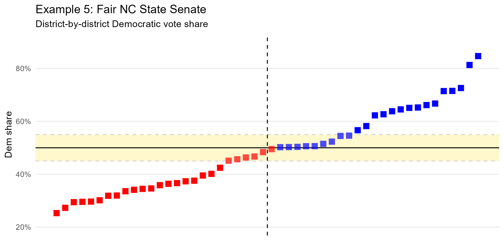

And visualize! Note: in reality, this map would not pass the extremely strict splitting laws that North Carolina has in place for the NCGA. But it's fun to imagine.

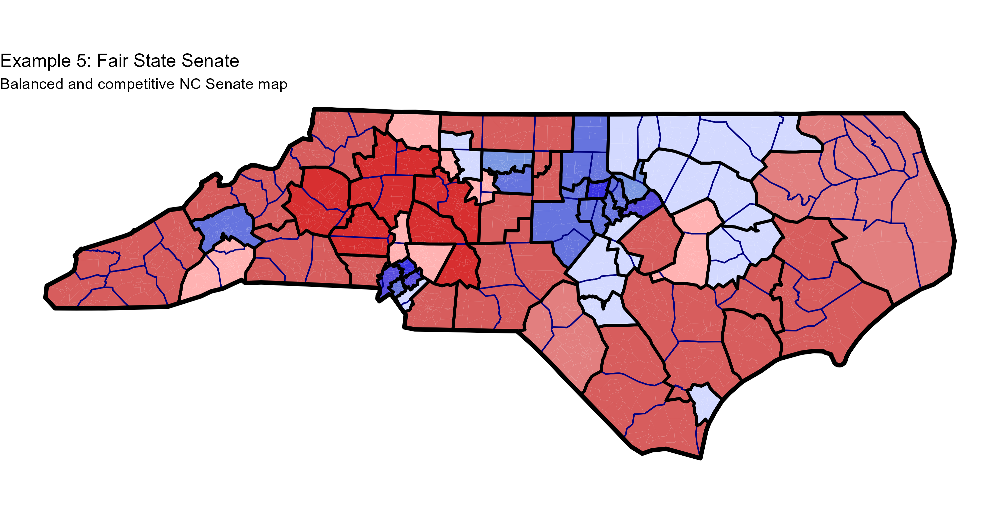

---

## Example 6: Dealing with Incumbents

Let's imagine that tomorrow a court orders that North Carolina draw a new, fair congressional map. *However*, the court orders that the remedial map try and keep incumbents apart.

Mosaic can help here. The program can handle both pro-bunking and anti-bunking lists. Pro-bunking lists aim to keep precincts together (like communities of interest). Anti-bunking lists aim to keep precincts apart (like incumbent homes).

### Set up the Incumbent List

We establish the incumbent list here. These are the precinct IDs (GEOIDs) for each North Carolina congressperson (roughly—we don't really know where they live). The first two values are the weight and the exponent (here, we go with 1000 and 1 respectively).

```r
NC_incumbent_list <- c(
  1000,              # Weight: heavy penalty for pairing
  1,                 # Exponent: linear penalty
  "3707900BEAR",     # Davis
  "37183001-27",     # Ross
  "3714701504A",     # Murphy
  "3713500000H",     # Foushee
  "37011000002",     # Foxx
  "37059000013",     # McDowell
  "37129000W25",     # Rouzer
  "37179000014",     # Harris
  "37125000SSP",     # Hudson
  "37035000013",     # Harrigan
  "370890000FR",     # Edwards
  "37119000011",     # Adams
  "37183001-36",     # Knott
  "3704500KM-N"      # Moore
)
```

We pass the bunking list by adding a call to `create_bunking_lists()` to `run_chain()`. Multiple sub-lists can be added to either `anti_bunking` or `pro_bunking`.

### Code

```r
results <- run_chain(
  shapefile_path = SHAPEFILE,
  num_districts = 14,
  seed = 123456,
  county_bias = 3,
  weight_county_splits = 15,
  target_mean_median = 0,
  weight_mean_median = 500,
  target_efficiency_gap = 0,
  weight_efficiency_gap = 100,
  num_steps = 2500,
  verbose_console = FALSE,
  verbose_initialization = FALSE,
  bunking_lists = create_bunking_lists(
    anti_bunking = list(NC_incumbent_list)
  )
)
```

### Results

Partisanship looks good. No major mean/median skew, and a healthy number of competitive districts.

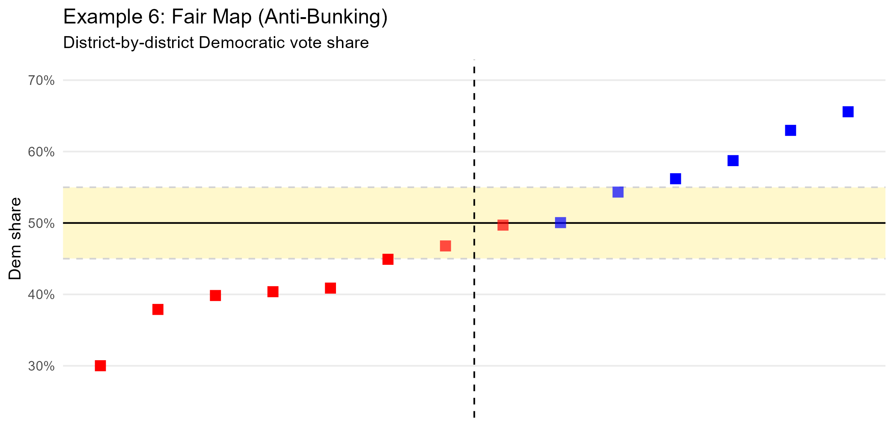

We can also pass bunking lists to `mosaic_plot()`—which makes it easy to visually check out the results. Each location will appear as a diamond.

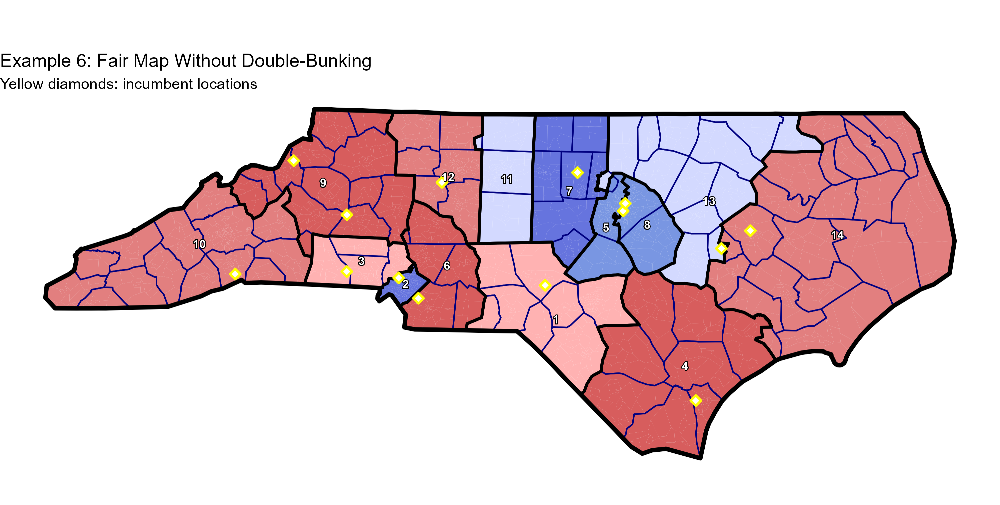

**Yellow diamonds** mark incumbent locations.

### Analysis

Not too shabby. The console report told us that the 14 precincts in Anti-Bunking List 1 were saved in 13 districts, and that seems apparent here (although some of them are right on the border). Foxx and Harrigan are both placed in District 9, but it's a hard prospect to avoid. NC Republicans are stacked on the west of the state because Foxx and Harrigan live on the far west sides of their current (real) districts.

Tim Moore (speaker of the NC House) didn't help this problem when he essentially drew his own district on that side of the state, and he lives in Kings Mountain.

---

## Example 7: Communities of Interest

In Example 6, we learned that Mosaic includes an anti-bunking functionality to incentivize keeping specific precincts apart (for instance, incumbents). However, Mosaic can also aim to *keep* precincts together—which can be used to create communities of interest.

There are 17 universities in the University of North Carolina system, scattered from UNC Wilmington on the Atlantic to ASU in the Appalachians. We initialize `NC_university_list` by putting all 17 universities' precincts' GEOIDs together, and weight this pro-bunking list at 5000.

### Set up the University List

```r
NC_university_list <- c(
  5000,              # Weight: heavy bias for grouping
  1,                 # Exponent: linear penalty
  "37183004-05",     # NC State
  "37063000047",     # NC Central
  "37063000007",     # NCSSM
  "37135000UNC",     # UNC Chapel Hill
  "37081000G44",     # NC A&T
  "37081000G64",     # UNC Greensboro
  "37067000403",     # Winston-Salem State
  "37067000705",     # UNCSA
  "37189000012",     # Appalachian State
  "370210010.1",     # UNC Asheville
  "37099000RIV",     # Western Carolina
  "37119000126",     # UNC Charlotte
  "37155000017",     # UNC Pembroke
  "3705100CC34",     # Fayetteville State
  "37129000W31",     # UNC Wilmington
  "37147001506",     # East Carolina
  "3713900EAST"      # Elizabeth City State
)
```

Again, we pass the bunking list by adding a call to `create_bunking_lists()` to `run_chain()`. This time, we add it to the `pro_bunking` list, and let it rip.

### Code

```r
results <- run_chain(
  shapefile_path = SHAPEFILE,
  num_districts = 14,
  seed = 123456,
  county_bias = 1.5,
  weight_county_splits = 5,
  target_mean_median = 0,
  weight_mean_median = 500,
  num_steps = 2500,
  verbose_console = FALSE,
  verbose_initialization = FALSE,
  bunking_lists = create_bunking_lists(
    pro_bunking = list(NC_university_list)
  )
)
```

### Results

A mean/median difference of R+0.9% isn't that bad, but since this is mostly a COI proof of concept, let's check out the map and see how Mosaic did at keeping the UNC system together.

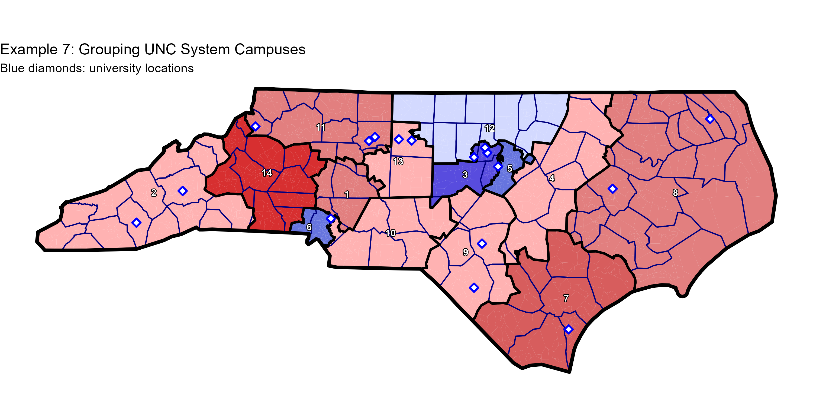

**Blue diamonds** mark university locations.

### Analysis

Excellent! The console output let us know that these 17 precincts (1 for each school) ended up in 6 different districts, and we verify that visually here.

- **District 8 grabs ASU, WCU, and UNC Asheville** by stretching up the TN border
- **All four Triad institutions** (UNCSA, UNCG, NC A&T, WSSU) end up in District 13
- **All four in the Triangle** (UNC, NC State, NCCU, and NCSSM) end up in District 9
- **UNC Pembroke, UNC Wilmington, and Fayetteville State** are kept in District 4
- **ECU and Elizabeth City State** are paired in District 14

Only one school (UNC Charlotte) ends up on its own, which is part tough luck and part a consequence of where it is geographically.

---

## Conclusion

These seven examples demonstrate Mosaic's versatility in handling a wide range of redistricting scenarios—from simple compactness optimization to complex partisan objectives, from protecting traditional boundaries to keeping incumbents separated, and from maximizing competitiveness to grouping communities of interest.

The same algorithmic framework handles all these scenarios through simple parameter adjustments, making Mosaic a powerful tool for understanding redistricting tradeoffs and exploring the space of possible maps.

---

## Running These Examples

All code from this tutorial is available in [`examples/nc-examples.R`](../../examples/nc-examples.R). To run:

```r
source("mosaic.R")
load_mosaic()
source("examples/nc-examples.R")
```

To regenerate all plots:

```r
source("generate_tutorial_plots.R")
```
