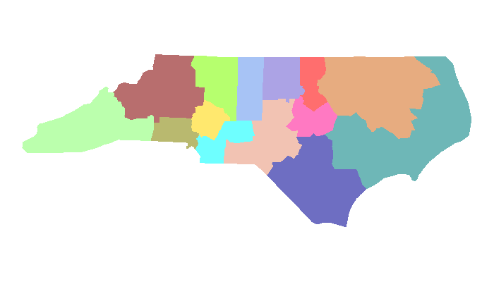
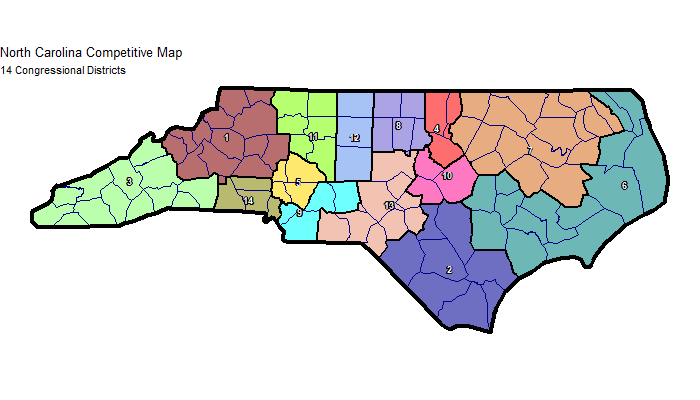
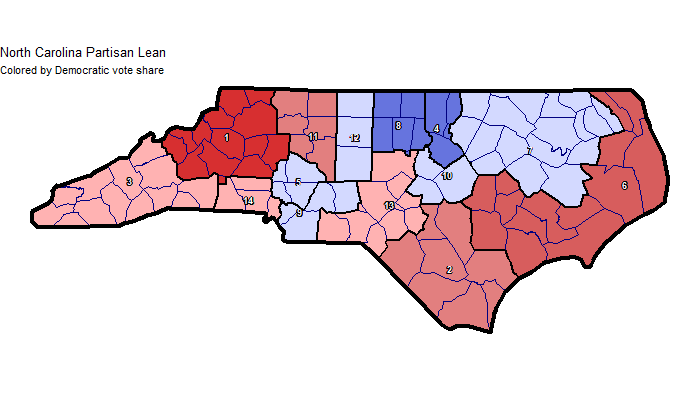
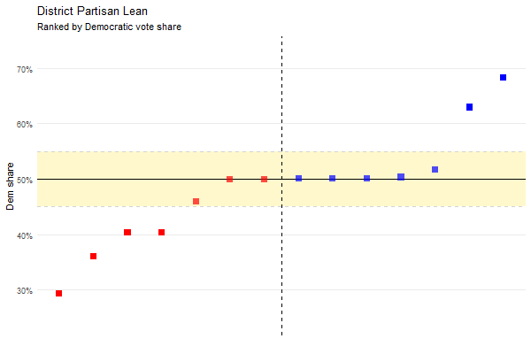

# Creating Maps with Mosaic

Mosaic includes powerful plotting functions to visualize your redistricting results. This guide covers `mosaic_plot()` for static maps and `mosaic_partisan_plot()` for partisan analysis graphs.

## Table of Contents

1. [The Basics](#the-basics)
2. [Example 1: Simple Map](#example-1-simple-map)
3. [Example 2: Customizing Visual Elements](#example-2-customizing-visual-elements)
4. [Example 3: Partisan Coloring](#example-3-partisan-coloring)
5. [Example 4: Partisan Analysis Graph](#example-4-partisan-analysis-graph)
6. [Parameter Reference](#parameter-reference)

---

## The Basics

Creating a map requires just two things:

1. **Run the chain** with `run_chain()` to generate district assignments
2. **Plot the results** using `mosaic_plot()` to visualize those assignments

Mosaic automatically uses the most recent results from your `output/` directory, so you don't need to specify file paths unless you want to plot older results.

---

## Example 1: Simple Map

Let's create a competitive 14-district map for North Carolina and visualize it.

### Code

```r
source("mosaic.R")
load_mosaic()

SHAPEFILE <- "shapefiles/North_Carolina_Simplified.shp"

# Run the chain optimizing for competitiveness
results <- run_chain(
  shapefile_path = SHAPEFILE,
  num_districts = 14,
  seed = 123456,
  county_bias = 5,
  weight_county_splits = 10,
  target_mean_median = 0,
  weight_mean_median = 150,
  weight_competitiveness = 10,
  num_steps = 3000,
  verbose_console = FALSE
)

# Create a simple map
mosaic_plot(
  shapefile_path = SHAPEFILE,
  type = "simple"
)
```

### Result



Each district gets a distinct color. This is the most basic visualization - clean and straightforward.

---

## Example 2: Customizing Visual Elements

Now let's add some visual elements to make the map more informative.

### Code

```r
# Add outlines and labels
mosaic_plot(
  shapefile_path = SHAPEFILE,
  type = "simple",
  title = "North Carolina Competitive Map",
  subtitle = "14 Congressional Districts",
  border_outline = TRUE,
  district_outline = TRUE,
  county_outline = TRUE,
  number_labels = TRUE
)
```

### Result



**What changed:**

- **Title and subtitle** provide context
- **Border outline** (thick black line) emphasizes the state boundary
- **District outline** (black lines) clearly separates districts
- **County outline** (navy lines) shows county boundaries
- **Number labels** identify each district

You can mix and match these elements. For a cleaner look, you might skip county outlines. For presentation slides, you might want just the border and district outlines.

---

## Example 3: Partisan Coloring

If your run included partisan data, you can color districts by Democratic vote share.

### Code

```r
# Color by partisan lean
mosaic_plot(
  shapefile_path = SHAPEFILE,
  type = "partisan",
  title = "North Carolina Partisan Lean",
  subtitle = "Colored by Democratic vote share",
  border_outline = TRUE,
  district_outline = TRUE,
  county_outline = TRUE,
  number_labels = TRUE
)
```

### Result



Districts are colored on a spectrum:

- **Deep red** = Strong Republican (low Dem vote share)
- **Light red/pink** = Lean Republican  
- **Purple** = Competitive (45-55% Dem)
- **Light blue** = Lean Democratic
- **Deep blue** = Strong Democratic (high Dem vote share)

**Note:** Partisan coloring requires that you ran with at least one partisan metric enabled (like `weight_mean_median`, `weight_efficiency_gap`, etc.). If you ran with only compactness objectives, Mosaic won't have tracked partisan data and so the plot will revert to simple mode.

You can do a chain run with `weight_mean_median = 0` (for example) if you want to track partisan data without actually using it to affect the algorithm's decisions.

---

## Example 4: Partisan Analysis Graph

For a complementary view of partisan balance, use `mosaic_partisan_plot()` to create a ranked graph of district partisanship.

### Code

```r
# Create partisan analysis graph
mosaic_partisan_plot(
  title = "District Partisan Lean",
  subtitle = "Ranked by Democratic vote share"
)
```

### Result



This graph shows:

- Each square represents one district
- Districts are ranked from most Republican (left) to most Democratic (right)
- The **yellow band** highlights competitive districts (45-55%)
- The **black horizontal line** marks 50% (even split)
- The **dashed vertical line** shows the median district

This visualization makes it easy to see:

- How many safe vs. competitive districts you have
- Whether the median district leans toward one party
- The overall partisan distribution

**Remember:** A partisan graph can't be run on a metrics CSV that doesn't contain partisan data - which means the annealing run had to include election tracking (even zero-weighted).

---

## Parameter Reference

### `mosaic_plot()`

#### Required
**`shapefile_path`** - Path to your shapefile
```r
shapefile_path = "shapefiles/North_Carolina_Simplified.shp"
```

#### Input Data
**`csv_path`** *(default: NULL)*  
Path to final assignments CSV. If `NULL`, uses most recent file.

**`metrics_path`** *(default: NULL)*  
Path to metrics CSV (required for partisan coloring). If `NULL`, uses most recent file.

**`output_dir`** *(default: "output")*  
Directory containing your output files.

#### Visualization Type
**`type`** *(default: "simple")*  
- `"simple"` - Each district gets a distinct color
- `"partisan"` - Color by Democratic vote share (requires partisan data)

```r
type = "simple"      # Distinct colors
type = "partisan"    # Partisan lean coloring
```

#### Visual Elements
**`border_outline`** *(default: FALSE)*  
Draw thick black line around entire state.

**`district_outline`** *(default: FALSE)*  
Draw black lines between districts.

**`county_outline`** *(default: FALSE)*  
Draw navy lines along county boundaries.

**`precinct_outline`** *(default: FALSE)*  
Draw faint white lines between precincts. (Usually too cluttered for static maps)

**`number_labels`** *(default: FALSE)*  
Add district numbers as labels.

```r
border_outline = TRUE    # Emphasize state boundary
district_outline = TRUE  # Show district boundaries
county_outline = TRUE    # Show county structure
number_labels = TRUE     # Label districts
```

#### Text
**`title`** *(default: "")*  
Main title for the plot.

**`subtitle`** *(default: "")*  
Subtitle text.

**`caption`** *(default: "")*  
Caption text at bottom.

```r
title = "North Carolina Congressional Map",
subtitle = "14 competitive districts",
caption = "Created with Mosaic"
```

#### Advanced
**`bunking_lists`** *(default: NULL)*  
Display bunking markers (see NC Examples tutorial for usage).

---

### `mosaic_partisan_plot()`

#### Input Data
**`metrics_path`** *(default: NULL)*  
Path to metrics CSV. If `NULL`, uses most recent file.

**`output_dir`** *(default: "output")*  
Directory containing your output files.

#### Text
**`title`** *(default: "")*  
Main title for the plot.

**`subtitle`** *(default: "")*  
Subtitle text.

**`caption`** *(default: "")*  
Caption text.

```r
mosaic_partisan_plot(
  title = "Partisan Balance",
  subtitle = "14 Congressional Districts"
)
```

---

## Tips and Tricks

**Start simple, then add complexity**  
Begin with `type = "simple"` and no outlines. Once you verify the map looks correct, add outlines and labels.

**Partisan mode requires partisan data**  
If `mosaic_plot()` reverts to simple mode when you specify `type = "partisan"`, you need to re-run with at least one partisan weight:
```r
run_chain(..., target_mean_median = 0, weight_mean_median = 1)
```

**County outlines can be cluttered**  
For states with many small counties, `county_outline = TRUE` can make maps hard to read. Try it both ways.

**Precinct outlines are rarely useful for static maps**  
They work better for GIFs where you see precincts moving between districts. For static maps, they just add visual noise.

**Save high-resolution versions**  
If you need publication-quality maps, save them explicitly:
```r
png("my_map.png", width = 1200, height = 800, res = 150)
mosaic_plot(...)
dev.off()
```

---

## Troubleshooting

**"No partisan data found" / Map reverts to simple mode**  
You ran the chain without partisan metrics. Re-run with at least one partisan parameter:
```r
run_chain(..., target_mean_median = 0, weight_mean_median = 1)
```

**County lines don't show up**  
Ensure your shapefile has a `CTY` column with county identifiers.

---

## Running These Examples

All code from this tutorial is available in [`examples/plotting-examples.R`](../../examples/plotting-examples.R). To run:

```r
source("mosaic.R")
load_mosaic()
source("examples/plotting-examples.R")
```

To regenerate the tutorial plots:

```r
source("generate_plotting_examples.R")
```

---

## Next Steps

- **[Creating Animated GIFs](gif-examples.md)** - Animate your districts evolving over time
- **[Scoring & Optimization](../guides/scoring.md)** - Deep dive into `run_chain()` parameters
- **[Mosaic in Action: North Carolina](nc-examples.md)** - Seven comprehensive examples